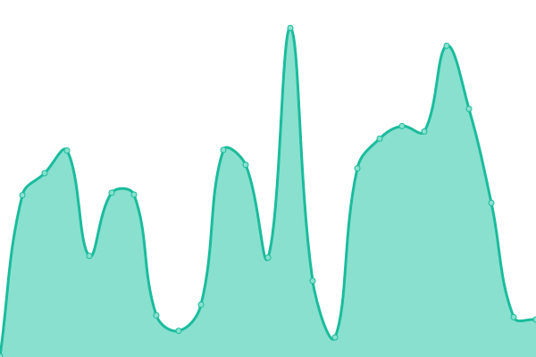

# [📈 Live Status](https://status.uvvu.pw): <!--live status--> **🟧 Partial outage**

<!--start: status pages-->
<!-- This summary is generated by Upptime (https://github.com/upptime/upptime) -->
<!-- Do not edit this manually, your changes will be overwritten -->
<!-- prettier-ignore -->
| URL | Status | History | Response Time | Uptime |
| --- | ------ | ------- | ------------- | ------ |
|  [Analytics](https://analytics.uvvu.pw) | 🟥 Down | [analytics.yml](https://github.com/u-v-v-u/status/commits/HEAD/history/analytics.yml) | 

 5841ms
     
 | 

<a href="https://status.uvvu.pw/history/analytics">78.46%</a>
    

|  [InfluxDB](https://influx.uvvu.pw) | 🟥 Down | [influx-db.yml](https://github.com/u-v-v-u/status/commits/HEAD/history/influx-db.yml) | 

 5725ms
     
 | 

<a href="https://status.uvvu.pw/history/influx-db">85.39%</a>
    

|  [Grafana](https://g.uvvu.pw) | 🟩 Up | [grafana.yml](https://github.com/u-v-v-u/status/commits/HEAD/history/grafana.yml) | 

 4793ms
     
 | 

<a href="https://status.uvvu.pw/history/grafana">56.20%</a>
    

<!--end: status pages-->

[**Visit our status website →**](https://status.uvvu.pw)

## 📄 License

- Powered by: [Upptime](https://github.com/upptime/upptime)
- Code: [MIT](./LICENSE) © [Upptime](https://upptime.js.org)
- Data in the `./history` directory: [Open Database License](https://opendatacommons.org/licenses/odbl/1-0/)
